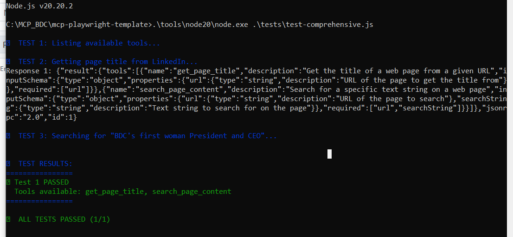
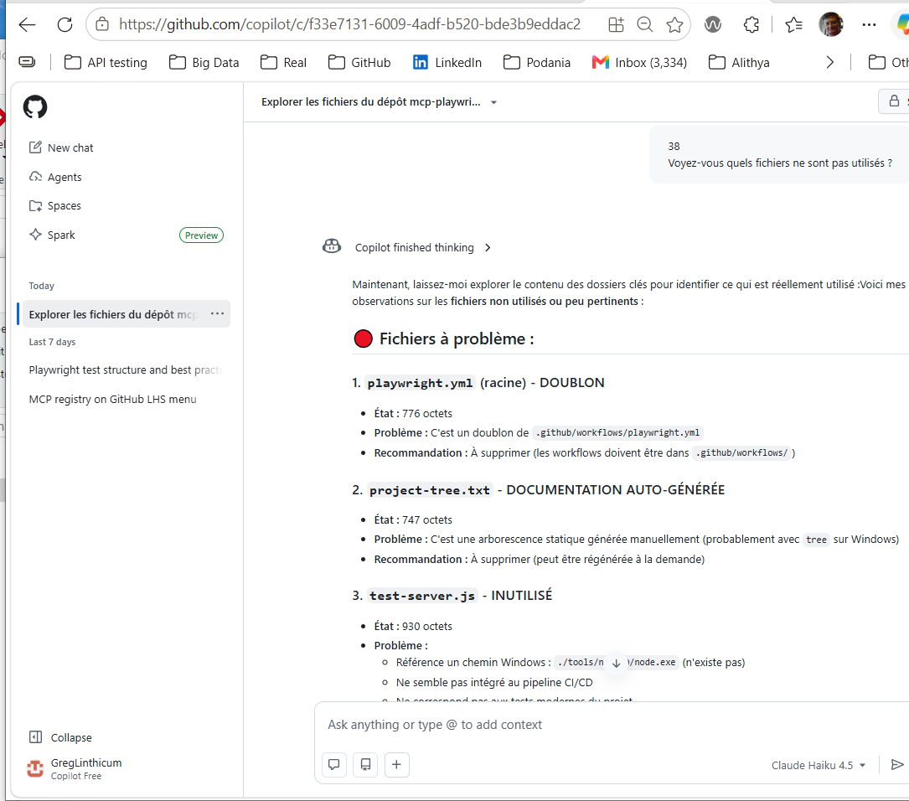

# Utilisation  
Le répertoire **mcp-playwright-template\tools\Node20** contient Node.js 20.20.2   
Le développeur doit donc installer une version de Node.js (globale ou spécifique au projet) dans ce répertoire et invoquer l’exécution locale via la commande suivante :  

**cmdmcp-playwright-template> .\tools\node20\node.exe .\tests\test-comprehensive.js**  

Le dossier tools est exclu de la synchronisation entre le poste de travail local et le dépôt GitHub.  

Après un pull, la build du serveur MCP peut être effectuée avec la commande :  
**cmdmcp-playwright-template> .\tools\node20\npm.cmd run build:mcp** 

Le fichier **playwright-mcp-config.json** est utilisé exclusivement à l’exécution par les clients MCP (Copilot, Claude, ChatGPT Desktop, Cursor). Il indique au client la procédure de démarrage du serveur MCP.  

Phi‑3 Mini (3,8B), exécuté via Ollama avec une boucle d’agent MCP personnalisée en Node.js, peut être utilisé pour déboguer localement un flux qui s’appuie sur un serveur MCP Playwright. 

# Le choix du moteur d'IA utilisé vous appartient.

### Toutefois, la prise en charge native de MCP (juin 2026) est limitée.  
|Provider	      |Free?  	|Native MCP Tool‑Calling?	|Usable in CI?	|Notes              |  
|-----------------|---------|--------------------------|--------------|------------------|  
|OpenAI	         |No	 |Yes                   |Yes       |Best option        |  
|Anthropic Claude | No	 |Yes	                   |Yes	|Strong alternative       |  
|Mistral	         |Yes (limited)	|No	|Yes (manual agent)	|Requires custom logic|  
|Ollama (local)	|Yes  |No	                   |Yes (manual agent) |Free + offline|  
|GitHub Copilot	|No   |Yes (IDE only)	       |No	       |Not for CI        |  
  
  
À ce jour, seuls deux fournisseurs prennent véritablement en charge MCP de manière native :  
  
🟦 OpenAI Assistants API  
🟪 Anthropic Claude Messages API  
  
Lors de l'exécution du test, le déroulement est le suivant : 

GitHub Action  
   ↓  
Node.js script (your MCP client)  
   ↓  
OpenAI Assistants API (model you choose)  
   ↓  
AI discovers MCP tools exposed by your server  
   ↓  
AI invokes tools (openPage, click, fill, evaluate…)  
   ↓  
Your MCP server executes Playwright actions  
   ↓  
Browser automation happens in CI  
   ↓  
AI returns PASS/FAIL reasoning  
  

# Pipeline et exécution multiplateforme

Le pipeline s’exécute sous **Ubuntu**, mais le testeur peut exécuter le même test Playwright sur sa machine Windows.  
C’est possible parce que, dans les deux cas, l’environnement d’exécution est **Node.js**.  

---

# Exécution de tests pilotée par l'intention avec MCP et Playwright

Ce projet démontre un modèle d'exécution alternatif pour l'automatisation Playwright utilisant le Model Context Protocol (MCP).

Dans une approche Playwright traditionnelle, la logique d'interaction est codée directement dans les tests au moyen de sélecteurs et d'actions prédéfinis :

- await page.locator('#login').fill(user);
- await page.locator('#password').fill(password);
- await page.locator('#submit').click();

Avec l'intégration MCP, le scénario de test peut être décrit à un niveau d'abstraction plus élevé, en mettant l'accent sur le flux métier, les critères d'acceptation et les validations attendues. Un client IA connecté via MCP peut alors traduire ces objectifs en actions Playwright au moment de l'exécution.

## Flux d'exécution
- Le développeur définit le scénario métier, les contraintes et les assertions.
- Le client IA détermine quelles actions sont nécessaires pour atteindre l'objectif demandé.
- Le client IA invoque les outils exposés par le serveur MCP.
- Le serveur MCP exécute les opérations Playwright correspondantes.
- Les résultats sont renvoyés au client IA pour analyse, validation ou génération d'un rapport.
- Résolution dynamique des éléments

Dans ce modèle, la résolution des sélecteurs peut être effectuée dynamiquement.

Au lieu de dépendre exclusivement de localisateurs codés en dur, le client IA peut analyser le DOM courant, identifier les éléments pertinents et adapter les interactions à certaines modifications de l'interface sans nécessiter de changement du code de test.

Les opérations sous-jacentes restent des opérations Playwright standard. MCP fournit uniquement un protocole permettant à un client IA de demander leur exécution.

## Répartition des responsabilités
###Composant	Responsabilité
- Développeur	Définit le flux métier, les règles fonctionnelles, les assertions et les critères d'acceptation
- Client IA	Détermine quels outils et quelles actions doivent être exécutés
- Serveur MCP	Expose les capacités d'automatisation sous forme d'outils invocables
- Playwright	Réalise les interactions avec le navigateur et le DOM
- Navigateur	Exécute l'application sous test  
  
Architecture  
Développeur  
     │  
     ▼  
Description du scénario  
     │  
     ▼  
Client IA  
     │  
     ▼  
Serveur MCP  
     │  
     ▼  
Playwright  
     │  
     ▼  
Navigateur  

## Indépendance vis-à-vis du modèle d'IA

MCP est indépendant du modèle utilisé.

Tout client IA compatible MCP peut être employé, à condition qu'il prenne en charge l'invocation d'outils MCP. Le protocole ne dépend d'aucun fournisseur particulier et n'impose ni modèle de langage, ni stratégie de raisonnement, ni mécanisme spécifique de génération de tests.

## Exemples de clients compatibles :

- GitHub Copilot
- Claude Desktop
- OpenAI ChatGPT avec support MCP
- Applications internes compatibles MCP
Cas d'utilisation

Cette architecture est particulièrement adaptée aux scénarios suivants :

- ests exploratoires assistés par IA
- Investigation dynamique d'anomalies
- Génération assistée de tests Playwright
- Vérifications ponctuelles nécessitant une navigation déterminée à l'exécution
- Automatisation pilotée par des objectifs métier plutôt que par des sélecteurs prédéfinis
- Quand utiliser des tests Playwright classiques

Les tests Playwright classiques demeurent généralement préférables lorsque l'objectif principal est :

- l'exécution déterministe ;
- la reproductibilité stricte des scénarios ;
- la stabilité des suites de régression ;
- l'intégration CI/CD ;
- les validations fonctionnelles répétitives.

# Résumé
- Le développeur définit les objectifs et les validations.
- Le client IA décide quelles actions doivent être exécutées.
- Le serveur MCP expose les capacités d'automatisation.
- Playwright contrôle le navigateur.
- Le navigateur exécute l'application sous test.

MCP ne remplace pas Playwright. Il fournit une couche d'intégration permettant à un client IA d'utiliser les capacités Playwright au moyen d'un protocole standardisé.

## Liste des LLM en lice pour la justification et l'entrée sur le marché du support natif pour MCP :
 - Canada  
 -- Cohere Command R+ — world‑class retrieval‑augmented model  
 -- Cohere Aya — multilingual, competitive with GPT‑4‑Turbo in many tasks  
 -- Cohere Embed v3 — state‑of‑the‑art embeddings  

 - Europe  
 -- Mistral (France) — Mixtral 8x22B is one of the strongest open models  
 -- Aleph Alpha (Germany) — enterprise‑grade, sovereign AI  
 -- DeepSeek Europe partners — inference‑optimized models  
 - Chine  
 -- DeepSeek V3 / R1 — extremely strong reasoning  
 -- Qwen 2.5 — competitive across benchmarks  
 -- Yi‑Lightning — optimized for speed  

## Ordre probable d'adoption du MCP natif :
 - Mistral — already experimenting with tool‑calling  
 - Cohere — enterprise‑focused, likely to add agent APIs  
 - Qwen / DeepSeek — extremely fast‑moving  
 - European sovereign AI — slower but inevitable  
  
But as of June 2026, your README is correct: Only OpenAI and Anthropic support MCP tool‑calling natively.  

====
  

## GitHub Copilot comprend et peut améliorer l'architecture du projet

